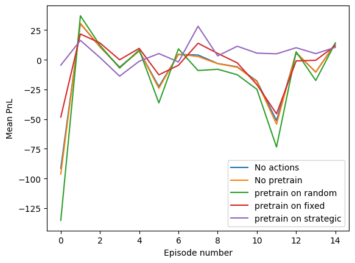
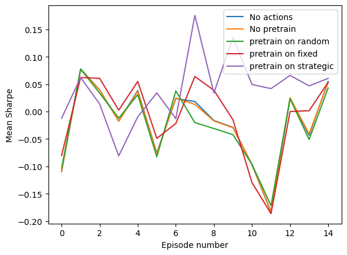
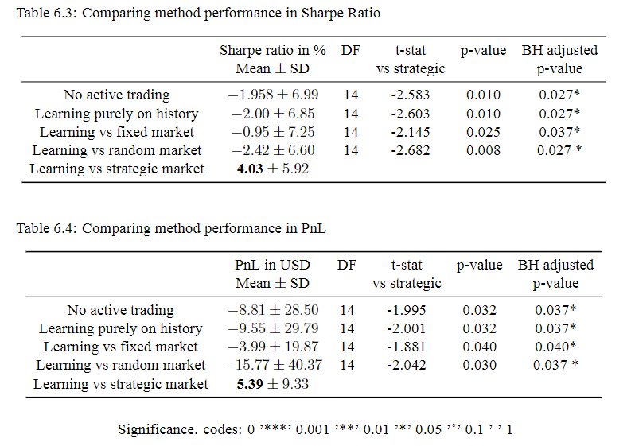

# Enhancing Portfolio Optimization via Adversarial Reinforcement Learning

This repository contains a code implementation of the Master Thesis **Enhancing Portfolio Optimization via Adversarial Reinforcement Learning** written by Matvey Lukyanov 2024.

## Idea

This thesis presents an innovative approach to portfolio optimization through the application of adversarial reinforcement learning. The research methodology involves training a portfolio optimization agent to choose portfolio weights for maximizing return while simultaneously training a market dynamics agent to minimize the portfolio return by manipulating market conditions such as drifts, volatilities, and correlations, modeled via geometrical brownian motion. In this adversarial framework, the portfolio agent learns to optimize under the most challenging market scenarios generated by the market agent. The learning pipeline involves obtaining pretrained weights for the portfolio agent by solving the adversarial reinforcement learning task and then using these pretrained weights as the initial parameters for a subsequent optimization task involving real market data.  The results demonstrate that the adversarial framework significantly enhances the portfolio agent's performance, achieving significantly better results than learning against fixed or random market agents or purely on historical data. This research contributes to the field of financial engineering by providing a novel methodology for improving portfolio optimization strategies through adversarial reinforcement learning, potentially offering a more resilient and effective approach to managing investment portfolios.

## Acknowledgemetns
This project uses [Regelum](https://regelum.aidynamic.io/) framework, made by AIDA lab.  Detailed documentation is available [here](https://regelum.aidynamic.io/).

## Repo description

* [`presets`](presets) — folder containing configs with all hyperparameters 

* [`src`](src) — folder containing all `.py` files - mainly inheritance from regelum repo.

* [`imgs`](imgs) — folder containing images of the project.

* [`launch.json`](.vscode/launch.json) — in case of work in vscode this config will help to rin and debug the repo more smoothly

* [`requirements.txt`](requirements.txt) — list with all needed dependencies for the repo run

* [`experiments.ipynb`](experiments.ipynb) — analysis of obtained callbacks, created by the script

* [`run.py`](run.py) — script to run the model


## Prerequisites
```commandline
git clone https://github.com/Matteus1904/portfolio_opt_regelum
cd portfolio_opt_regelum
pip install -r requirements.txt
```

## Running
To reproduce results, you just ran the `run.py ` using Python kernel with neccesary packages (installed in Prerequisites section). The code was tested in `Python 3.9.16`. The code execution in other Python versions is not guaranteed.

To run the default experiments in parallel, use the following command:
```
python run.py --single-thread --parallel
```
or in the following way to run sequentially:

```
python run.py
```
It will save the results into `regelum_data` folder.


## Numerical results
Below numerical results can be seen:




